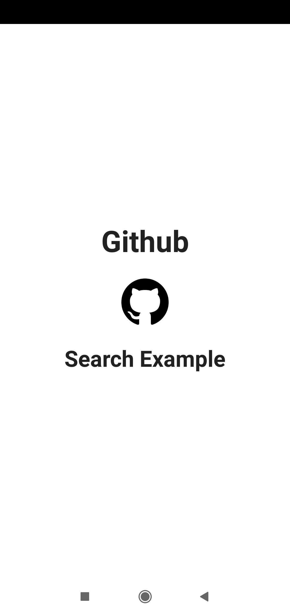
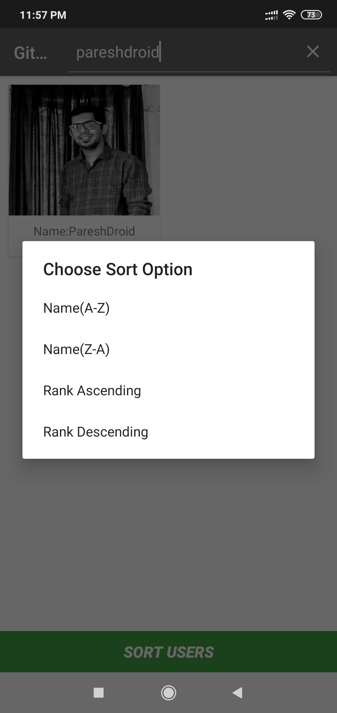
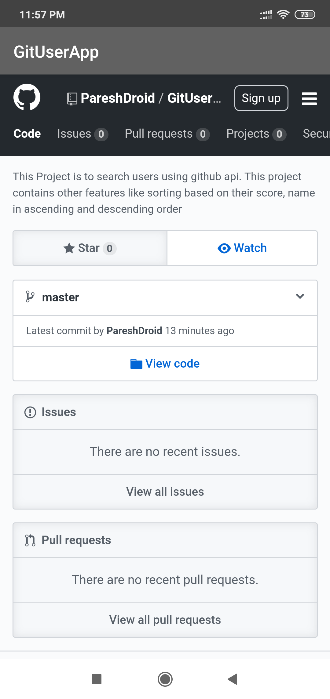

# GitUserApp

This Project is to search users using github api. This project contains other features like sorting based on their score, name in ascending and descending order
This uses MVVM pattern using ViewModel, Livedata, Retrofit, RxJava and Picasso. This app searches user asynchronusly(as you type).

The example uses Github API. This app searches users based on Github API. Once users are searched you can click on any user
and can check all his repositories by clicking on any user.

Note:: Theme colors used in this application are similar to github web app

Below are the screenshots of the image
1) Splash screen of the application

2) Option to search users and sort them based on their score and name

Search Screen

Sort Dialog

3) When you click any one user you can get all his repository-

Repository Screen

4) On clicking any of the repository you will be redirected to that repository in the webview-

WebView

